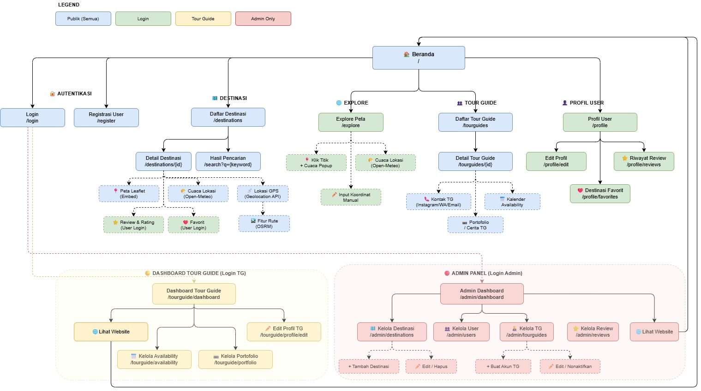

# BearTrails

**Platform Wisata Interaktif Lombok**  
*Follow the Trail, Discover the World*

## 📋 Deskripsi Project

BearTrails adalah website yang membantu wisatawan menemukan destinasi wisata di Lombok, melihat informasi cuaca real-time, peta interaktif, serta terhubung langsung dengan Tour Guide lokal terverifikasi.

---

## ✨ Fitur Utama

### Untuk Pengguna
- Jelajah destinasi dengan filter dan pencarian
- Detail destinasi lengkap (peta, cuaca real-time, forecast 7 hari, galeri foto, review)
- Fitur rute menuju destinasi
- Simpan destinasi favorit
- Daftar & detail Tour Guide + jadwal ketersediaan
- Profil pengguna + riwayat review

### Untuk Tour Guide
- Dashboard khusus Tour Guide
- Kelola profil, jadwal ketersediaan, dan portofolio
- Verifikasi akun oleh Admin

### Untuk Admin
- Kelola destinasi, user, dan Tour Guide
- Toggle status Tour Guide
- Monitoring review dan data platform

---

## 👥 Tim Pengembang

| Nama       | Role              | Tanggung Jawab Utama                          |
|------------|-------------------|-----------------------------------------------|
| **FATIO**  | Fullstack         | Database, Migration, Model, Integrasi API, Seeder, Deployment |
| **ALIF**   | Backend           | Controller, Middleware, Logic, Authentication, Authorization |
| **RIVAL**  | Frontend          | UI/UX, Blade Template, Responsive Design, Styling |

## 🛠 Tech Stack

| Kategori       | Teknologi                          |
|----------------|------------------------------------|
| Backend        | Laravel 12                         |
| Frontend       | Blade Template + Alpine.js         |
| Styling        | Tailwind CSS v4                    |
| Database       | MySQL                              |
| Mapping        | Leaflet.js + OpenStreetMap         |
| Weather        | Open-Meteo API                     |
| Authentication | Laravel Breeze                     |
| Lainnya        | Git, Composer, npm, Vite           |


## 📁 Struktur Folder Utama

```
BearTrails/
├── app/Models/                 # Semua Eloquent Models
├── app/Http/Controllers/       # Controller
├── database/migrations/        # Migration files
├── database/seeders/           # Seeder & Factory
├── resources/views/            # Blade Templates
│   ├── layouts/
│   ├── destinations/
│   ├── tourguides/
│   └── admin/
├── routes/web.php
├── BUG/                        # Dokumentasi Bug
│   ├── SS Bug 1/
│   ├── SS Bug 2/
│   ├── SS Bug 3/
│   └── SS Bug 4/
├── public/assets/
└── README.md
```

## 🎯 Sitemap



---

## Bug Log

### Bug 1 — Halaman Explore Tidak Ditemukan

Gejala: Klik menu Explore di navbar → error 500 `View [explore] not found`

Langkah reproduksi:
1. Buka website BearTrails
2. Klik menu Explore di navbar
3. Halaman error 500 muncul

Hipotesis penyebab: Nama file view salah — tersimpan sebagai `explor.blade.php` bukan `explore.blade.php` (typo satu huruf)

Fix: Rename file dari `explor.blade.php` menjadi `explore.blade.php`


---

### Bug 2 — Dashboard Tour Guide Error 500

Gejala: Login sebagai Tour Guide → redirect ke dashboard → error 500 `Call to undefined method TourguideProfile::availabilities()`

Langkah reproduksi:
1. Login sebagai akun Tour Guide
2. Sistem redirect ke /tourguide/dashboard
3. Halaman error 500 muncul

Hipotesis penyebab: Relasi `availabilities()` dan `portfolios()` belum didefinisikan di Model `TourguideProfile`

Fix: Tambahkan relasi `hasMany` ke `TourguideAvailability` dan `TourguidePortfolio` di Model `TourguideProfile`


---

### Bug 3 — Layout Galeri Foto Destinasi Kacau

Gejala: Halaman detail destinasi dengan lebih dari 1 foto galeri — layout foto berantakan dan tidak proporsional

Langkah reproduksi:
1. Buka halaman detail destinasi yang punya 3 atau lebih foto galeri
2. Layout foto terlihat kacau dan nabrak konten lain

Hipotesis penyebab: Layout grid galeri tidak menyesuaikan jumlah foto — semua kondisi dipaksa pakai grid 4 kolom meskipun fotonya hanya 2 atau 3

Fix: Tambahkan kondisi tampilan berdasarkan jumlah foto (1 foto = full width, 2 foto = 2 kolom, 3 foto = 3 kolom, 4+ foto = 1 besar kiri + grid kecil kanan)


---

### Bug 4 — Admin Tidak Bisa Hapus Review

Gejala: Login sebagai Admin → coba hapus review di halaman detail destinasi → error 403 Forbidden

Langkah reproduksi:
1. Login sebagai Admin
2. Buka halaman detail destinasi yang ada reviewnya
3. Klik tombol Hapus Review
4. Error 403 Forbidden muncul

Hipotesis penyebab: Method `destroy` di `ReviewController` hanya mengizinkan pemilik review yang bisa hapus, tidak ada pengecekan role admin

Fix:
```php
// Sebelum
if ($review->user_id !== auth()->id()) {
    abort(403);
}

// Setelah
if (auth()->user()->role !== 'admin' && $review->user_id !== auth()->id()) {
    abort(403);
}
```


Oke! Ini narasi Bug #5 untuk README:

---

### Bug 5 — Form Edit Destinasi Tidak Bisa Submit

Gejala: Halaman edit destinasi yang sudah punya foto galeri — tombol Simpan Perubahan tidak bisa diklik sama sekali, tidak terjadi apa-apa saat diklik

Langkah reproduksi:
1. Login sebagai Admin
2. Buka edit destinasi yang sudah punya foto galeri
3. Ubah data apapun atau langsung klik Simpan Perubahan
4. Tidak terjadi apa-apa, halaman tidak bergerak

Hipotesis penyebab: Terdapat elemen `<form>` hapus foto yang berada di dalam `<form>` edit utama (nested form). HTML tidak mengizinkan form di dalam form — browser mengabaikan form luar sehingga tombol Simpan tidak bisa submit

Fix: Hapus elemen form hapus foto, ganti tombol hapus dengan JavaScript `fetch()` yang mengirim request DELETE langsung ke server tanpa membutuhkan elemen form

```


```

---

## AI Usage Statement

### FATIO (Fullstack)

1) Tool: Claude AI (Anthropic)

2) Untuk apa:
- Memahami konsep migration Laravel (tipe data, foreign key, constraint)
- Memahami cara kerja Eloquent ORM dan relasi antar model
- Belajar cara integrasi Open-Meteo API dan Leaflet.js di Laravel
- Debugging error yang muncul saat development
- Memahami cara kerja seeder dan storage symlink

3) Prompt utama:
- "Jelaskan perbedaan hasMany dan belongsTo di Laravel Eloquent dengan contoh kasus tour guide dan availability"
- "Bagaimana cara fetch data dari Open-Meteo API menggunakan JavaScript dan tampilkan di Blade Laravel?"
- "Contoh migration Laravel lengkap dengan berbagai tipe data (string, decimal, enum, foreignId, timestamps)"

4) Bagian output AI yang dipakai:
- Pemahaman konsep relasi Eloquent untuk Model TourguideProfile, TourguideAvailability, TourguidePortfolio
- Struktur fetch API Open-Meteo di JavaScript (parameter hourly, daily, current)
- Pemahaman cara kerja php artisan storage:link dan symlink

5) Bagian yang saya ubah dan alasan:
- Data seeder destinasi → diganti dengan destinasi nyata Lombok beserta koordinat GPS yang akurat
- Parameter API Open-Meteo → ditambah timezone=Asia/Makassar karena default UTC menyebabkan jam tidak sesuai waktu Indonesia Tengah (WITA)
- Struktur migration → disesuaikan dengan kebutuhan project (tambah kolom entry_fee, price_per_day, status, dll)

### Rival (Frontend)

1) Tool: ChatGPT (OpenAI) & Claude AI (Anthropic)

2) Untuk apa:
- Memahami implementasi Blade Laravel untuk membangun antarmuka pengguna.
- Mempelajari teknik responsive web design menggunakan Bootstrap/Tailwind CSS.
- Memahami cara menampilkan data dari backend Laravel ke halaman frontend menggunakan Blade Template Engine.
- Belajar cara integrasi Open-Meteo API ke dalam tampilan halaman destinasi dan fitur Explore.
- Memahami implementasi Leaflet.js untuk menampilkan peta interaktif dan marker destinasi wisata.
- Mempelajari praktik UI/UX yang baik untuk platform wisata berbasis web.
- Debugging error frontend seperti tampilan tidak responsif, data tidak muncul, atau error JavaScript.
- Memahami struktur dan alur kode frontend yang telah dibuat selama proses pengembangan.

3) Prompt utama:
- "Bagaimana membuat halaman destinasi wisata yang responsif menggunakan Blade Laravel dan Bootstrap/Tailwind CSS?"
- "Bagaimana cara menampilkan data dari controller Laravel ke Blade dan melakukan looping daftar destinasi beserta gambar, kategori, dan deskripsinya?"
- "Berikan contoh implementasi Leaflet.js untuk menampilkan marker destinasi wisata berdasarkan koordinat latitude dan longitude dari database Laravel."
- "Bagaimana cara menampilkan data cuaca dari Open-Meteo API menggunakan JavaScript pada halaman detail destinasi?"
- "Apa praktik terbaik UI/UX untuk platform wisata yang memiliki fitur destinasi, tour guide, review, favorit, dan peta interaktif?"

4) Bagian output AI yang dipakai:
- Referensi struktur layout halaman menggunakan Blade Template Engine.
- Pemahaman konsep responsive web design menggunakan CSS dan Bootstrap/Tailwind CSS.
- Struktur dasar integrasi Leaflet.js untuk menampilkan peta interaktif dan marker destinasi.
- Referensi implementasi JavaScript untuk menampilkan informasi cuaca dari Open-Meteo API.
- Pemahaman teknik debugging frontend terkait tampilan, responsivitas, dan manipulasi DOM.

5) Bagian yang saya ubah dan alasan:
- Layout halaman → disesuaikan dengan desain UI BearTrails yang telah dirancang oleh tim karena output AI hanya memberikan contoh umum.
- Komponen destinasi, tour guide, dan dashboard → dimodifikasi agar sesuai dengan kebutuhan fitur dan identitas visual BearTrails.
- Implementasi Leaflet.js → disesuaikan dengan data destinasi wisata Lombok beserta koordinat yang digunakan dalam sistem.
- Tampilan informasi cuaca → diubah agar lebih mudah dipahami pengguna dan sesuai dengan desain antarmuka BearTrails.
- Responsive design → breakpoint, grid layout, dan ukuran komponen disesuaikan secara manual agar optimal pada desktop, tablet, dan smartphone.
- Seluruh implementasi frontend → setelah memperoleh referensi dari AI, kode dipelajari kembali dan diimplementasikan sendiri sesuai kebutuhan proyek BearTrails.

### Alief (Backend)

**Tool:** Claude AI (Anthropic)

**Untuk apa:**
- Memahami konsep migration Laravel (tipe data, foreign key, constraint, relasi antar tabel)
- Memahami struktur dasar Controller (resource controller, CRUD pattern) sebelum dikustomisasi sesuai business logic project
- Generate dummy data untuk seeder (`DestinationSeeder`, `TourguideSeeder`)
- Memahami penggunaan Middleware untuk role-based access (Admin, Tourguide, User)
- Troubleshooting error pada terminal saat menjalankan `php artisan migrate` dan `php artisan db:seed`
- Debugging error yang muncul saat development backend

**Prompt utama:**
- "Contoh migration Laravel lengkap dengan berbagai tipe data (string, decimal, enum, foreignId, timestamps, dll)"
- "Jelaskan struktur dasar resource controller di Laravel untuk CRUD (index, store, update, destroy)"
- "Buatkan dummy data untuk seeder destinasi wisata dan tourguide di Laravel"

**Bagian output AI yang dipakai:**
- Pemahaman struktur 1 contoh migration lengkap (mencakup berbagai tipe data) sebagai referensi
- Pemahaman pola dasar resource controller (struktur method index, store, update, destroy)
- Dummy data dari AI untuk `DestinationSeeder` dan `TourguideSeeder`
- Solusi/penjelasan untuk error migration/seeding di terminal (misalnya foreign key constraint, urutan seeder)

**Bagian yang saya ubah dan alasan:**
- Migration untuk 7 tabel lainnya → ditulis manual sendiri berdasarkan kebutuhan struktur data masing-masing tabel (`Destination`, `DestinationImage`, `Review`, `Favorite`, `TourguideProfile`, `TourguideAvailability`, `TourguidePortfolio`)
- Logic CRUD dasar dari AI → disesuaikan dengan business logic project (validasi, relasi antar model, role-based access lewat `RoleMiddleware`)
- Dummy data dari AI → _(diganti dengan data dari kaggle)_
- Error saat migrate/seed (contoh: foreign key constraint, urutan eksekusi seeder) → diselesaikan dengan menyesuaikan urutan migration/seeder sendiri setelah memahami akar masalahnya dari penjelasan AI
---

## 👏 Terima Kasih
